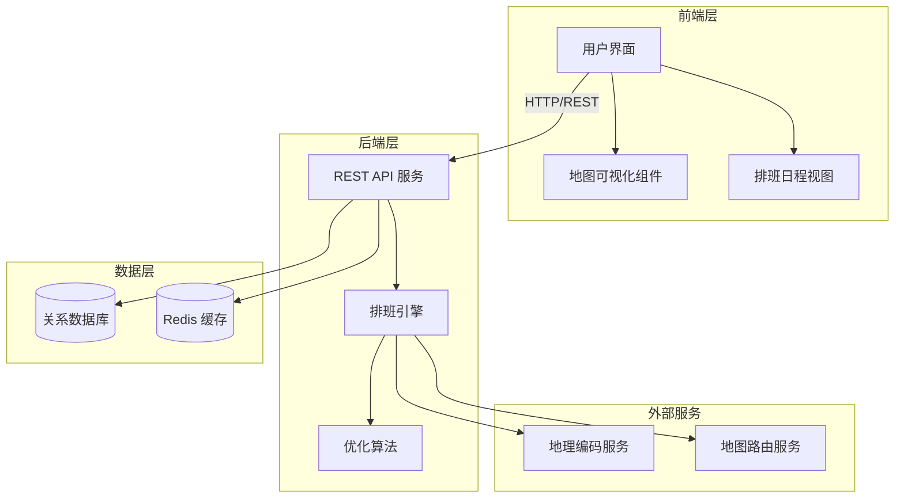

# 验货排班系统技术设计文档

Feature Name: inspection-scheduling
Updated: 2026-02-09

## 描述

验货排班系统是一个基于 Web 的应用程序，用于管理每周验货任务的自动分配和优化。系统需要考虑地理位置、时间、距离、工作负荷等多个约束条件，生成最优排班方案。系统采用前后端分离架构，前端提供直观的排班管理和可视化功能，后端负责排班算法计算和数据管理。

## 架构



系统采用经典的三层架构：前端层、后端层和数据层。前端使用现代化 Web 框架提供用户交互界面，后端提供 RESTful API 和排班计算服务，数据层使用关系数据库存储业务数据。系统还集成外部地理编码和地图路由服务，用于计算距离和最优路线。

## 组件和接口

### 前端组件

#### 用户界面 (UI)
- **职责**：提供整体的页面布局和导航
- **技术栈**：React + TypeScript + Ant Design

#### 地图可视化组件 (MapComponent)
- **职责**：在地图上展示验货员路线、工厂位置和验货点
- **技术栈**：Leaflet 或 Mapbox GL JS
- **接口**：
  - `renderSchedule(schedule: ScheduleResult): void` - 渲染排班结果到地图
  - `highlightInspector(inspectorId: string): void` - 高亮特定验货员路线

#### 排班日程视图 (ScheduleView)
- **职责**：以日历或时间轴形式展示排班结果
- **技术栈**：React + Ant Design
- **接口**：
  - `displayWeeklySchedule(schedules: WeeklySchedule[]): void` - 显示周排班表
  - `editTaskAssignment(taskId: string, inspectorId: string): void` - 编辑任务分配

### 后端服务

#### REST API 服务
- **职责**：提供 HTTP API 接口供前端调用
- **技术栈**：Node.js + Express + TypeScript
- **主要接口**：
  - `POST /api/schedule/generate` - 触发自动排班
  - `GET /api/schedule/:id` - 获取排班结果
  - `PUT /api/schedule/:id` - 更新排班方案
  - `GET /api/inspectors` - 获取验货员列表
  - `POST /api/inspectors` - 添加验货员
  - `GET /api/factories` - 获取工厂列表
  - `POST /api/factories` - 添加工厂
  - `GET /api/tasks` - 获取验货任务列表
  - `POST /api/tasks` - 创建验货任务
  - `GET /api/stats/cost` - 获取成本统计

#### 排班引擎 (Scheduler)
- **职责**：协调排班算法和外部服务，生成排班方案
- **技术栈**：Node.js + TypeScript
- **主要方法**：
  - `generateSchedule(tasks: Task[], inspectors: Inspector[], config: ScheduleConfig): Promise<ScheduleResult>`
  - `calculateDistance(inspectorLocation: Location, factoryLocation: Location): Promise<number>`
  - `calculateRoute(locations: Location[]): Promise<Route>`

#### 优化算法 (Optimizer)
- **职责**：实现排班优化算法，考虑多目标优化
- **技术栈**：Node.js + TypeScript
- **算法说明**：
  - 使用遗传算法或模拟退火算法进行多目标优化
  - 优化目标：最小化总时间、最小化成本、均衡工作负荷
  - 约束条件：工作时间上限、任务截止日期、验货员可用时间

### 数据访问层

#### 数据库模型

**验货员 (Inspector)**
```typescript
interface Inspector {
  id: string;
  name: string;
  baseLocation: {
    address: string;
    latitude: number;
    longitude: number;
  };
  contact: string;
  maxWorkHoursPerWeek: number;
  unavailableDates: string[];
}
```

**工厂 (Factory)**
```typescript
interface Factory {
  id: string;
  name: string;
  address: string;
  latitude: number;
  longitude: number;
  contact: string;
}
```

**验货任务 (Task)**
```typescript
interface Task {
  id: string;
  factoryId: string;
  scheduledDate: Date;
  estimatedDuration: number; // 小时
  taskType: string;
  deadline: Date;
  priority: number;
  status: 'pending' | 'assigned' | 'completed';
}
```

**排班方案 (Schedule)**
```typescript
interface Schedule {
  id: string;
  weekStart: Date;
  weekEnd: Date;
  assignments: Assignment[];
  totalCost: number;
  totalTravelTime: number;
  workloadVariance: number;
  createdAt: Date;
}

interface Assignment {
  taskId: string;
  inspectorId: string;
  scheduledDate: Date;
  estimatedArrivalTime: Date;
  estimatedDepartureTime: Date;
  travelTime: number;
  route: Location[];
}
```

## 数据模型

### 数据库设计

使用关系数据库（如 PostgreSQL 或 MySQL）存储业务数据。

**表结构**：

1. **inspectors** - 验货员表
   - id (PK, UUID)
   - name (VARCHAR)
   - base_address (TEXT)
   - base_latitude (FLOAT)
   - base_longitude (FLOAT)
   - contact (VARCHAR)
   - max_work_hours_per_week (INT)
   - created_at (TIMESTAMP)
   - updated_at (TIMESTAMP)

2. **factories** - 工厂表
   - id (PK, UUID)
   - name (VARCHAR)
   - address (TEXT)
   - latitude (FLOAT)
   - longitude (FLOAT)
   - contact (VARCHAR)
   - created_at (TIMESTAMP)
   - updated_at (TIMESTAMP)

3. **tasks** - 验货任务表
   - id (PK, UUID)
   - factory_id (FK → factories.id)
   - scheduled_date (DATE)
   - estimated_duration (FLOAT)
   - task_type (VARCHAR)
   - deadline (DATE)
   - priority (INT)
   - status (ENUM: pending, assigned, completed)
   - created_at (TIMESTAMP)
   - updated_at (TIMESTAMP)

4. **inspector_unavailability** - 验货员不可用日期表
   - id (PK, UUID)
   - inspector_id (FK → inspectors.id)
   - date (DATE)
   - reason (TEXT)
   - created_at (TIMESTAMP)

5. **schedules** - 排班方案表
   - id (PK, UUID)
   - week_start (DATE)
   - week_end (DATE)
   - total_cost (FLOAT)
   - total_travel_time (FLOAT)
   - workload_variance (FLOAT)
   - status (ENUM: draft, confirmed, completed)
   - created_at (TIMESTAMP)
   - updated_at (TIMESTAMP)

6. **assignments** - 任务分配表
   - id (PK, UUID)
   - schedule_id (FK → schedules.id)
   - task_id (FK → tasks.id)
   - inspector_id (FK → inspectors.id)
   - scheduled_date (DATE)
   - estimated_arrival_time (TIMESTAMP)
   - estimated_departure_time (TIMESTAMP)
   - travel_time (FLOAT)
   - route (JSONB)
   - created_at (TIMESTAMP)
   - updated_at (TIMESTAMP)

7. **schedule_config** - 排班配置表
   - id (PK, UUID)
   - weight_time (FLOAT)
   - weight_cost (FLOAT)
   - weight_workload (FLOAT)
   - transport_mode (ENUM: car, train, public_transport)
   - created_at (TIMESTAMP)
   - updated_at (TIMESTAMP)

## 正确性属性

### 不变量 (Invariants)

1. **任务唯一分配**：每个验货任务在同一排班方案中只能分配给一个验货员
   - 对于任意 schedule，所有 assignments 中的 task_id 必须唯一

2. **工作负荷约束**：验货员的总工作时长不超过其最大周工作时长
   - 对于任意 inspector，Σ(assigned_task_duration + travel_time) ≤ max_work_hours_per_week

3. **时间连续性**：验货员在同一天的任务时间不能重叠
   - 对于任意 inspector 在同一日期，所有任务的时间区间不能重叠

4. **截止日期约束**：任务完成时间不能晚于任务截止日期
   - 对于任意 assignment，scheduled_date ≤ task.deadline

5. **可用时间约束**：验货员在不可用日期不能分配任务
   - 对于任意 assignment，scheduled_date 不在 inspector.unavailable_dates 中

### 数据一致性

1. **地理位置一致性**：所有地理位置坐标使用统一的坐标系（WGS84）
2. **时间一致性**：所有时间戳使用统一的时区（建议使用 UTC）
3. **状态一致性**：任务状态与分配状态保持同步

## 错误处理

### 错误场景和处理策略

1. **地理编码失败**
   - **场景**：外部地理编码服务返回错误或超时
   - **处理**：提示用户手动输入经纬度坐标，或使用默认坐标并在后续校准

2. **无解情况**
   - **场景**：约束条件过于严格，无法生成有效的排班方案
   - **处理**：返回错误信息，指出哪些约束条件导致无解，建议放宽约束或增加验货员

3. **外部服务不可用**
   - **场景**：地图或地理编码服务临时不可用
   - **处理**：使用缓存的历史数据，或提供简化模式（只使用直线距离计算）

4. **并发冲突**
   - **场景**：多个用户同时编辑同一排班方案
   - **处理**：使用乐观锁机制，检测到冲突时提示用户重新加载数据

5. **数据验证失败**
   - **场景**：用户输入的数据不符合业务规则
   - **处理**：返回具体的验证错误信息，指出哪些字段不符合要求

## 测试策略

### 单元测试

- **排班算法测试**：验证优化算法在简单场景下能够找到最优解
- **距离计算测试**：验证距离计算的准确性
- **工作负荷计算测试**：验证工作负荷统计的正确性
- **约束检查测试**：验证各种约束条件的正确实现

### 集成测试

- **API 接口测试**：验证 REST API 的正确性
- **数据库操作测试**：验证数据持久化和查询的正确性
- **外部服务集成测试**：验证与地理编码和地图服务的集成

### 端到端测试

- **完整排班流程测试**：从创建任务到生成排班方案的完整流程
- **手动调整流程测试**：自动排班后手动调整任务的流程

### 性能测试

- **算法性能测试**：测试算法在不同规模任务下的执行时间
- **并发请求测试**：测试系统同时处理多个排班请求的能力

### 测试覆盖率目标

- 单元测试覆盖率 ≥ 80%
- 集成测试覆盖所有主要业务流程
- 端到端测试覆盖典型用户场景

## 参考文献

[^1]: (Website) - Google Maps Platform Distance Matrix API [https://developers.google.com/maps/documentation/distance-matrix](https://developers.google.com/maps/documentation/distance-matrix)
[^2]: (Website) - Genetic Algorithm for Vehicle Routing Problem [https://en.wikipedia.org/wiki/Vehicle_routing_problem](https://en.wikipedia.org/wiki/Vehicle_routing_problem)
[^3]: (Website) - EARS Requirements Specification Guide [https://www.modernrequirements.com/ears-requirements/](https://www.modernrequirements.com/ears-requirements/)
